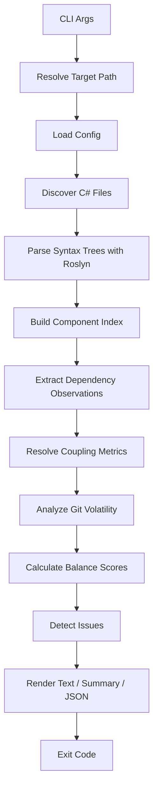

# アーキテクチャ・解析パイプライン・Roslyn 設計

## 7. 全体アーキテクチャ

### 7.1 MVP 構成

MVP では単一 CLI プロジェクトで開始してよい。

```text
dotnet-coupling/
  src/
    DotnetCoupling.Cli/
      DotnetCoupling.Cli.csproj
      Program.cs
      Analysis/
        Models.cs
        CSharpDependencyAnalyzer.cs
        GitVolatility.cs
        ReportRenderer.cs
  tests/
    DotnetCoupling.Tests/
  .github/
    workflows/
      release.yml
  README.md
  DESIGN.md
```

### 7.2 Phase 3 以降の物理分割

```text
dotnet-coupling/
  src/
    DotnetCoupling.Cli/
      Program.cs
    DotnetCoupling.Core/
      Model/
      Scoring/
      Reporting/
      Config/
    DotnetCoupling.Roslyn/
      SyntaxAnalyzer.cs
      SemanticAnalyzer.cs
      WorkspaceLoader.cs
    DotnetCoupling.Git/
      GitVolatilityAnalyzer.cs
      BaselineAnalyzer.cs
    DotnetCoupling.Sarif/
      SarifRenderer.cs
  tests/
    DotnetCoupling.Core.Tests/
    DotnetCoupling.Roslyn.Tests/
    DotnetCoupling.IntegrationTests/
```

Phase 3 では、semantic mode の土台として物理 project を分割する。`Cli` は
orchestration に集中し、`Core` は公開 data contract / scoring / reporting、
`Roslyn` は syntax / semantic 解析、`Git` は volatility / baseline を担当する。

### 7.3 Phase 1 内部モジュール境界

Phase 1 では NuGet tool と CLI 契約を安定させるため、物理プロジェクトは
`DotnetCoupling.Cli` のまま維持する。ただし、実装上は v0.2 以降の分割先を
意識して、次の責務境界を守る。

| Phase 1 module | Responsibility | Future package |
|---|---|---|
| `CliApplication` / `Program` | CLI options, exit codes, output routing | `DotnetCoupling.Cli` |
| `FileDiscovery` | target path expansion, generated-code exclusion | `DotnetCoupling.Core` or `DotnetCoupling.Roslyn` |
| `CSharpSyntaxDependencyCollector` | syntax-only Roslyn traversal and observations | `DotnetCoupling.Roslyn` |
| `CouplingResolver` | observations to coupling metrics | `DotnetCoupling.Core` |
| `CouplingScoring` | score and grade policy | `DotnetCoupling.Core` |
| `IssueDetector` | issue policy and graph/temporal heuristics | `DotnetCoupling.Core` |
| `ExternalCouplingDetector` | external namespace/package usage detection | `DotnetCoupling.Core` |
| `GitVolatility` | git log parsing and temporal co-change | `DotnetCoupling.Git` |
| `ReportRenderer` | text, summary, JSON rendering | `DotnetCoupling.Core` now; dedicated reporting package if formats grow |
| `Models` | report and analysis data contracts | `DotnetCoupling.Core` |

Guardrails:

- CLI code may orchestrate analysis, but must not contain Roslyn traversal,
  scoring policy, or issue detection rules.
- Roslyn collection may produce components, observations, and using namespaces,
  but must not calculate grades, render output, or inspect CLI options.
- Git volatility must remain recoverable: git absence or log failure should
  degrade to no volatility data rather than failing normal analysis.
- JSON schema shape and CLI exit codes are public contracts for Phase 1.
- Internal helper methods used for tests should remain `internal` with test
  assembly access, not accidental public API.

---

## 8. 解析パイプライン

### 8.1 処理フロー



### 8.2 ステップ詳細

| ステップ | 内容 |
|---|---|
| Resolve Target Path | 入力パスを絶対パスへ変換し、存在確認する |
| Load Config | MVP では `.coupling.json` / `coupling.json` のみ読む。TOML は v0.2 で追加する |
| Discover C# Files | `*.cs` を再帰探索する。`bin`, `obj`, `.git`, `.vs`, generated code は除外する |
| Parse Syntax Trees | Roslyn の `CSharpSyntaxTree` で構文解析する |
| Build Component Index | 型、名前空間、ファイル、プロジェクト情報をインデックス化する |
| Extract Dependency Observations | 型参照、生成、メソッド呼び出し、継承、interface 実装などを抽出する |
| Resolve Coupling Metrics | 依存元・依存先・強さ・距離を `CouplingMetrics` に変換する |
| Analyze Git Volatility | `git log` からファイル変更回数と temporal co-change を集計する |
| Calculate Balance Scores | 各結合にスコアを付与する |
| Detect Issues | しきい値に基づいて issue を生成する |
| Render | text / summary / json を出力する |
| Exit Code | `--check` の結果に応じて `0` または `1` を返す |

### 8.3 元ツールとの互換方針

`cargo-coupling` v0.3.3 と同じ思想を優先し、MVP でも以下は合わせる。

- Health Grade は平均スコアではなく **issue density** で決める
- S grade は最高評価ではなく **過剰最適化の警告** とする
- Low severity は strict mode で既定非表示にする
- 外部依存はレポート対象にはするが、内部 health grade の主計算からは原則除外する
- blind spots / manifest を出力に含め、「観測できなかったもの」を明示する

---

## 9. 解析対象の粒度

### 9.1 MVP の粒度

MVP では **型レベル** を基本粒度にする。

```text
Namespace.Type -> Namespace.Type
```

例:

```text
MyApp.Api.UsersController -> MyApp.Application.CreateUserHandler
MyApp.Application.CreateUserHandler -> MyApp.Domain.User
MyApp.Infrastructure.SqlUserRepository -> MyApp.Domain.IUserRepository
```

### 9.2 集約粒度

内部では型レベルで保持し、出力時に以下へ集約できるようにする。

| 粒度 | 用途 |
|---|---|
| Type | 詳細な依存検出 |
| Namespace | アーキテクチャ境界の確認 |
| Project | ソリューション内のプロジェクト間依存 |
| Assembly / Package | 外部依存の確認 |

### 9.3 将来の粒度

v0.3 以降で method-level dependency を追加する。

```text
Namespace.Type.Method -> Namespace.OtherType.Method
```

これは `--trace` や `--impact` の精度向上に効く。

---

## 10. Roslyn 解析設計

### 10.1 MVP: Syntax-only analyzer

MVP では `Microsoft.CodeAnalysis.CSharp` を使い、`SyntaxNode` ベースで解析する。

主な対象ノード:

| Syntax Node | 用途 |
|---|---|
| `NamespaceDeclarationSyntax` | namespace 抽出 |
| `FileScopedNamespaceDeclarationSyntax` | file-scoped namespace 抽出 |
| `ClassDeclarationSyntax` | class 定義 |
| `RecordDeclarationSyntax` | record 定義 |
| `StructDeclarationSyntax` | struct 定義 |
| `InterfaceDeclarationSyntax` | interface 定義 |
| `EnumDeclarationSyntax` | enum 定義 |
| `BaseListSyntax` | 継承・interface 実装 |
| `UsingDirectiveSyntax` | using 依存 |
| `FieldDeclarationSyntax` | field 型依存 |
| `PropertyDeclarationSyntax` | property 型依存 |
| `MethodDeclarationSyntax` | 引数・戻り値依存 |
| `ConstructorDeclarationSyntax` | コンストラクタ引数依存 |
| `ObjectCreationExpressionSyntax` | `new` による具象依存 |
| `InvocationExpressionSyntax` | メソッド呼び出し |
| `MemberAccessExpressionSyntax` | field / property / static member 参照 |
| `GenericNameSyntax` | generic type 依存 |
| `AttributeSyntax` | attribute 依存 |

### 10.2 v0.3: Project model and semantic analyzer

v0.3 では semantic resolution の前に project model を固める。まず `.slnx` /
`.sln` / `.csproj` から project graph、project boundary distance、assembly /
NuGet package 境界、workspace load diagnostics を得られるようにし、その上で
`MSBuildWorkspace` による symbol resolution を追加する。

syntax mode では workspace load failure を fatal error にしない。solution に含まれる
missing project、invalid `.csproj`、解決できない `ProjectReference` は recoverable
diagnostic として `manifest.diagnostics` に出し、読み込めた project だけで解析を継続する。

追加で得られる情報:

- 型名の完全修飾名
- interface と concrete class の正確な判定
- project / assembly 境界
- NuGet package 由来の型かどうか
- overload resolution
- extension method の実体
- alias / global using の解決
- partial class の統合
- generated code の判定精度向上

### 10.3 Syntax-only の限界

MVP では以下の誤検知・見逃しがある。

- 同名型の区別が曖昧
- `using` alias の完全解決が難しい
- extension method の呼び出し先が分からない
- DI コンテナ登録から実行時依存は追えない
- source generator 生成コードは基本的に追わない
- `dynamic` / reflection は正確に追えない

このため MVP 出力には `Analysis confidence: syntax-only` のような注意書きを出す。
